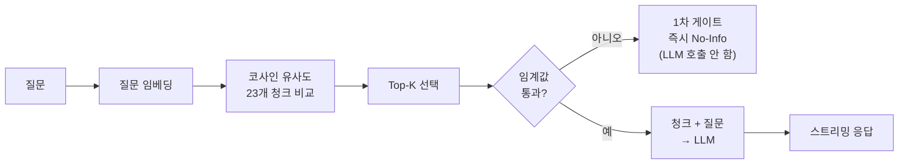
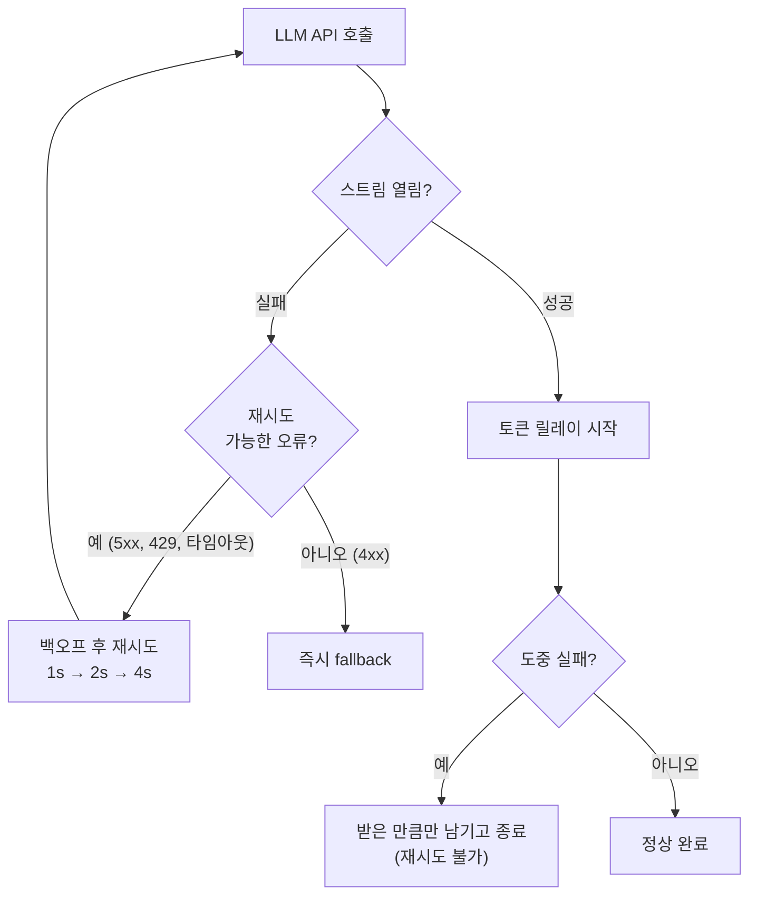

# LLM API 스트리밍, FastAPI로 릴레이할 때 생기는 문제들 — 타임아웃과 429 사이에서

[지난 글](#)에서 포트폴리오 RAG 챗봇의 검색 로직을 numpy로 구현하고, 코사인 유사도만으로는 "사실이 아닌 답변"을 막을 수 없다는 걸 확인했다. 그때 "시스템 프롬프트가 최후 방어선"이라고 예고했는데, 실제로 FastAPI 서버를 붙여보니 방어선은 한 겹이 아니라 두 겹이 필요했다.

이번 글은 검색 로직 위에 서버를 얹으면서 부딪힌 문제들이다. 스트리밍, 재시도, 동시 요청 제어 — 일반적인 REST API를 만들 때와는 다른 판단이 필요한 지점들이 있었다.

---

## 개념 정리 — 이 글을 읽기 위한 배경

LLM 백엔드가 처음이라면 아래 개념부터 짚고 가면 좋다. 나도 이번에 직접 부딪히면서 정리한 것들이다.

### RAG 파이프라인이 실제로 하는 일

RAG(Retrieval-Augmented Generation)는 이름 그대로 "검색으로 보강한 생성"이다. 질문이 들어오면 LLM에게 바로 던지지 않고, 먼저 내 문서에서 관련 조각을 찾아 근거로 함께 건네준다.



중요한 건 LLM이 "알고 있는 것"으로 답하는 게 아니라 **건네받은 청크만 보고 답한다**는 점이다. 그래서 검색이 틀린 청크를 가져오면 답변도 같이 틀린다.

### 임베딩과 코사인 유사도

임베딩은 텍스트를 숫자 배열로 바꾸는 것이다. `text-embedding-3-small`은 문장 하나를 1536개의 숫자로 만든다. 이 숫자 배열들이 공간상에서 가까우면 "의미가 비슷하다"는 뜻이고, 그 가까운 정도를 재는 게 코사인 유사도다(0에 가까울수록 무관, 1에 가까울수록 유사).

지난 글에서 확인한 함정이 여기 있다. **코사인 유사도는 "주제가 비슷하다"를 잴 뿐 "사실이 맞다"를 재지 않는다.** "Kafka를 써봤나"와 "메시지 큐를 다뤄봤나"는 임베딩 공간에서 가깝게 찍히지만, 전자는 내 경력에 없는 사실이다.

### 스트리밍과 TTFT

일반적인 API는 응답을 한 번에 완성해서 보낸다. LLM은 답변이 길면 몇 초씩 걸리기 때문에, 완성될 때까지 기다리면 사용자는 빈 화면을 본다. 그래서 토큰이 생성되는 대로 조금씩 흘려보내는 게 스트리밍이다.

여기서 중요한 지표가 **TTFT(Time To First Token)** — 첫 글자가 화면에 나타나기까지 걸리는 시간이다. 전체 응답 시간(total)보다 TTFT가 체감 속도를 좌우한다. 총 3초가 걸려도 첫 글자가 0.9초에 뜨면 "빠르다"고 느끼고, 총 2초여도 2초 내내 빈 화면이면 "느리다"고 느낀다.

### 재시도(retry)와 백오프

외부 API는 네트워크 문제나 일시적 서버 오류로 실패할 수 있다. 이때 바로 포기하지 않고 잠깐 기다렸다 다시 부르는 게 재시도다. 간격을 점점 늘리는 방식(1초 → 2초 → 4초)을 exponential backoff라고 한다.

핵심은 **모든 실패를 재시도하면 안 된다**는 것이다. 서버가 잠깐 맛이 간 거라면 다시 부르면 되지만, 요청 자체가 잘못됐다면(잘못된 모델명, 인증 실패) 백 번을 불러도 결과는 같다. 이 구분을 안 하면 이번에 내가 겪은 문제가 생긴다.

### 세마포어(Semaphore)

동시에 실행되는 작업 수에 상한을 두는 장치다. `Semaphore(1)`이면 한 번에 하나씩만 처리하고, 나머지는 앞 작업이 끝날 때까지 대기한다. LLM API는 짧은 시간에 요청이 몰리면 429(Too Many Requests)를 반환하는데, 이걸 사용자에게 그대로 노출하는 대신 서버 안에서 줄을 세우는 용도로 쓴다.

---

## 1. No-Info를 두 겹으로 막았다

지난 글의 결론은 "임계값만으로는 못 막는다"였다. 그래서 방어선을 두 단계로 나눴다.

| 게이트 | 예시 질문 | 동작 |
|---|---|---|
| **1차 · 검색 단계** | "리액트 네이티브 경험 있나요?" | 임계값 0.3을 넘는 청크 0개 → LLM 호출 없이 즉시 No-Info. **토큰 비용 0원** |
| **2차 · 시스템 프롬프트** | "GraphQL API 설계해본 적 있나요?" | 임계값 통과 청크 4개(주제만 겹침) → LLM이 청크를 읽고 "없다"고 판단 |

1차는 싸고 빠르다. 백엔드와 완전히 무관한 질문은 여기서 걸러지고 API 호출조차 하지 않는다. 2차는 비용이 들지만 정확하다. "주제는 겹치지만 사실이 아닌" 질문은 결국 LLM이 청크를 직접 읽어야 판별할 수 있다.

**그리고 UI 일관성 문제가 하나 더 있었다.** 2차 게이트에 걸린 경우 검색 자체는 성공한 상태라 출처 칩이 3개 딸려 있다. "GraphQL 경험은 없습니다"라고 답하면서 화면 아래에 "티켓팅 · ARCHITECTURE" 칩이 떠 있으면, 사용자 입장에선 "없다면서 왜 출처가 있지?"가 된다. 답변과 화면이 서로 모순되는 것이다.

그래서 2차 게이트가 발동하면 출처 칩을 숨기도록 했다. 실제 응답에서 `isMuted: true`, 칩 0개로 확인했다.

> 📸 **캡처 위치 1** — 두 게이트를 나란히 실행한 결과와 서버 로그.
> 클라이언트 이벤트 흐름이 `no_info` 하나(1차) vs `token → sources → done`(2차)로 갈리고,
> 서버 로그에는 1차 아래에 `chat/completions` 호출이 아예 없다 — 토큰 비용 0원의 증거.

### top-1만 믿지 않는다

지난 글의 KNS 사례 — 정답 청크가 0.4034로 2위, 무관한 청크가 0.4121로 1위였던 문제 — 는 top-5를 **전부** 프롬프트에 넣는 것으로 대응했다. LLM이 5개를 다 읽고 질문에 맞는 걸 고르게 하는 방식이다.

다만 화면에 보여주는 칩은 상위 3개까지만 노출한다. 이유는 아래 결함 C에서 다룬다.

---

## 2. 기획서에 없던 문제 — "그 프로젝트"가 검색되지 않는다

검증 항목에는 "연속 대화에서 맥락을 참조하는가"가 있었는데, 아키텍처에는 이걸 처리할 자리가 없었다.

```
1턴: "비포펫에서 어려웠던 점은?"
2턴: "그 프로젝트에서 다른 이슈는 없었어?"
```

처음엔 대화 이력을 LLM 프롬프트에 넣으면 해결될 거라 생각했다. 그런데 안 됐다. **검색 단계가 먼저 실패하기 때문이다.**

"그 프로젝트에서 다른 이슈는 없었어?"를 그대로 임베딩하면, 이 문장에는 비포펫에 대한 정보가 하나도 없다. 대명사는 벡터 공간에서 아무것도 가리키지 않는다. 그러니 엉뚱한 청크가 검색되고, LLM은 이력을 보고 비포펫 얘기인 건 알지만 정작 손에 쥔 근거는 다른 프로젝트 것이 된다.

해결은 코드 두 줄이었다. 검색용 쿼리를 만들 때 직전 질문을 앞에 붙여서 임베딩한다.

```python
def build_search_query(question: str, history: deque) -> str:
    if history:
        return f"{history[-1]['question']}\n{question}"
    return question
```

**LLM 프롬프트용 이력**과 **검색용 쿼리**는 다른 것이라는 걸 여기서 알았다. 둘 다 "대화 맥락"이지만 쓰이는 곳이 달라서, 하나만 챙기면 반쪽만 동작한다.

---

## 3. 추론 모델과 스트리밍 UX의 충돌

답변 품질을 위해 추론 모델을 골랐는데, 추론 모델은 답을 내기 전에 내부 추론을 먼저 돌린다. 그동안 사용자 화면에는 아무것도 나오지 않는다. 품질을 위한 선택이 체감 속도를 깎아먹는 구조다.

| 설정 | TTFT | total | 비고 |
|---|---|---|---|
| gpt-5.4-mini 기본 | 1385ms | 2488ms | — |
| gpt-5.4-mini `reasoning=minimal` | — | — | **이 모델 미지원 (400)** |
| gpt-5.4-mini `reasoning=low` | **924ms** | 2195ms | 채택 |
| gpt-4.1-mini (비추론) | 672ms | 1423ms | 가장 빠르나 품질 낮음 |

네트워크 상황에 따라 실행마다 편차가 있었다(기본 설정은 1.2~3.1초 사이에서 관측). 다만 **기본 > low > 비추론** 순서는 매번 동일하게 재현됐다.

`reasoning_effort`를 low로 낮춰 TTFT를 924ms까지 줄이고 품질은 유지하는 선에서 타협했다. `minimal`은 이 모델에서 지원하지 않아 400 에러가 났다.

그리고 이 지점에서 **UI의 "Thinking" 배지가 왜 필요한지**가 설명된다. 첫 토큰까지 1초 가까이 걸리는 건 구조적으로 피할 수 없으니, 그 시간 동안 "지금 생각 중"이라는 신호를 주는 것이다. 기술적 한계를 UI로 흡수한 셈이다.

> 📸 **캡처 위치 2** — TTFT 벤치마크 실행 결과 터미널. 네 가지 설정이 나란히 찍힌 화면.

---

## 4. 스트리밍에서는 재시도가 공짜가 아니다

일반적인 API라면 실패했을 때 다시 부르면 그만이다. 스트리밍은 다르다.

토큰이 이미 흘러나오기 시작한 뒤에 실패해서 재시도하면, 앞부분이 중복된 답변이 만들어진다. 사용자 화면에는 "비포펫에서는 이미지 업로드 시비포펫에서는 이미지 업로드 시 413 에러가..." 같은 게 찍힌다. 클라이언트가 이미 받아간 토큰을 되돌릴 방법이 없기 때문이다.

그래서 재시도 경계를 **"스트림을 여는 시점까지"**로 그었다.



**트레이드오프**: 스트림 도중에 끊기면 답변이 잘린다. 하지만 중복된 답변을 보여주는 것보다는 낫다고 판단했다.

---

## 5. 재시도하면 안 되는 실패도 있다

여기서 실제 결함이 하나 나왔다.

재시도 대상을 `APIStatusError`로 뭉뚱그려 잡아뒀더니, 잘못된 모델명이나 인증 실패처럼 **몇 번을 다시 불러도 결과가 같은 오류**에도 1초 + 2초 + 4초를 꼬박 기다린 뒤에야 fallback으로 넘어갔다. sleep만 7초, 여기에 실패하는 네트워크 왕복 4회가 더해져 **실측 8.7초**였다. 사용자는 이미 확정된 실패를 그만큼 기다린 셈이다.

조건을 나눴다.

```python
def is_retryable(error: Exception) -> bool:
    # RateLimitError(429)는 APIStatusError의 서브클래스라 먼저 확인한다.
    if isinstance(error, (RateLimitError, APIConnectionError, APITimeoutError)):
        return True
    if isinstance(error, APIStatusError):
        return error.status_code >= 500
    return False
```

기준은 단순하다. **"다시 부르면 결과가 달라질 수 있는가."** 서버 오류(5xx), 429, 네트워크 타임아웃은 달라질 수 있다. 4xx는 요청 자체가 잘못된 것이라 달라지지 않는다.

주의할 점 하나 — `RateLimitError`(429)는 `APIStatusError`의 서브클래스다. 순서를 바꿔서 `APIStatusError`를 먼저 검사하면 429가 4xx로 분류돼 재시도되지 않는다.

존재하지 않는 모델명으로 확정된 실패(404)를 만들어 두 정책을 같은 조건에서 측정했다.

| 정책 | 시도 횟수 | fallback까지 |
|---|---|---|
| 수정 전 — `APIStatusError` 전부 재시도 | 4회 | 8.70초 |
| 수정 후 — 4xx 제외 | 1회 | **0.22초** |

**결과: fallback까지 8.7초 → 0.22초.**

> 📸 **캡처 위치 3** — 재시도 정책 전후 비교 벤치마크. 두 정책이 한 화면에 같이 측정되어 나오므로
> 이미지를 따로 합칠 필요가 없다.

---

## 6. 큐 대신 세마포어를 골랐다

기획서에는 `asyncio.Queue`로 rate limit을 흡수한다고 적어뒀는데, 구현하면서 바꿨다.

이유는 스트리밍 때문이다. 토큰을 요청 핸들러가 직접 클라이언트로 릴레이해야 하는데, 작업을 큐로 넘기면 **생성된 토큰을 되돌려받는 큐가 하나 더 필요해진다.** 큐 두 개를 관리하는 복잡도가, "동시 실행에 상한을 둔다"는 목적에 비해 과했다.

세마포어는 이걸 한 줄로 해결한다. 핸들러가 세마포어를 잡고, 못 잡으면 대기하고, 끝나면 놓는다. 릴레이 흐름은 그대로 유지된다.

동시 요청 6건을 던져본 결과:

| 완료 순번 | 1 | 2 | 3 | 4 | 5 | 6 |
|---|---|---|---|---|---|---|
| 응답 시간 | 5.4s | 6.5s | 8.4s | 10.1s | 11.8s | **13.5s** |

계단식으로 늘어나는 게 순차 처리가 동작한다는 증거다. 전부 HTTP 200, 에러 0건.

**트레이드오프**: 상한이 1이라 6번째 요청은 13.5초를 기다린다. 개인 포트폴리오 트래픽에선 감수할 만하지만, 동시 방문자가 늘면 가장 먼저 손봐야 할 숫자다.

> 📸 **캡처 위치 4** — 동시 요청 벤치마크 실행 결과. 계단식으로 늘어나는 완료 시간이 한눈에 보인다.

---

## 7. 테스트가 아니었으면 배포 후에 알았을 문제

fallback을 검증하려고 로그를 파일로 리다이렉트했는데, 로컬 터미널에서 잘 보이던 로그가 사라졌다.

원인은 파이썬의 stdout 버퍼링이었다. 출력 대상이 터미널(tty)일 때는 줄 단위로 바로 내보내지만, 파일이나 파이프면 버퍼가 찰 때까지 모아뒀다가 한꺼번에 쓴다. 배포 환경에서는 로그가 파일이나 수집기로 가니까, **장애가 나도 로그가 안 남는다**는 뜻이었다.

`print()`를 전부 `logging`으로 교체했다.

우연히 발견한 문제다. fallback 테스트를 안 돌렸으면 배포 후에, 그것도 진짜 장애가 났을 때 알았을 것이다.

---

## 8. 답변에 쓰이지 않은 출처가 노출됐다

비포펫 질문에 검색된 top-5를 그대로 칩으로 띄웠더니, 0.307로 겨우 임계값을 넘긴 `티켓팅 인프라 · PROBLEM`이 근거처럼 보였다. LLM은 그 청크를 답변에 쓰지 않았는데 화면에는 출처로 떠 있는 상황이다.

프롬프트에는 5개를 다 넣되(top-1 오답 대비) 화면 칩은 상위 3개까지만 노출하도록 분리했다. **LLM에게 주는 근거의 범위**와 **사용자에게 보여주는 출처의 범위**는 다른 문제였다.

---

## 검증 결과

| 항목 | 결과 | 확인 내용 |
|---|---|---|
| 프로젝트별 답변 정확도 | 통과 | 답변이 지식베이스 내용과 일치 |
| 지어내지 않는지 | 통과 | 2단 게이트 모두 차단, 칩 0개 |
| 연속 대화 맥락 | 통과 | "그 프로젝트"로 직전 프로젝트 청크 검색 |
| fallback | 통과 | 0.61s에 청크 링크 반환 (임베딩 포함 end-to-end) |
| 동시 요청 · 상태 전이 | 통과 | 6건 순차 처리, 에러 0건 |
| rate limit | 통과 | 60초 10회 초과 차단, 300자 초과 422 |

---

## 정리하며

두 편에 걸쳐 확인한 걸 한 줄로 줄이면 이렇다. **검색은 후보를 추리는 단계일 뿐이고, 정확성은 그 뒤에 겹겹이 쌓은 방어선에서 나온다.**

그리고 LLM 백엔드가 일반 API 백엔드와 다른 지점이 몇 군데 있었다.

- 재시도에 경계가 필요하다 (스트림을 연 뒤에는 되돌릴 수 없다)
- 모든 실패가 재시도 대상이 아니다 (4xx는 기다릴 이유가 없다)
- 첫 토큰까지의 시간이 전체 시간보다 중요하다
- 응답이 스트림이라 큐로 넘기기 어렵다

기획서에 적어둔 설계 중 실제로 바꾼 건 큐 → 세마포어 하나였다. 나머지는 대체로 맞았지만, 대명사 후속질문처럼 기획 단계에서 아예 보이지 않던 문제도 있었다. 이건 다음 글에서 따로 다룰 예정이다.

**Live Demo**: (배포 URL)
**GitHub**: (리포 URL)
